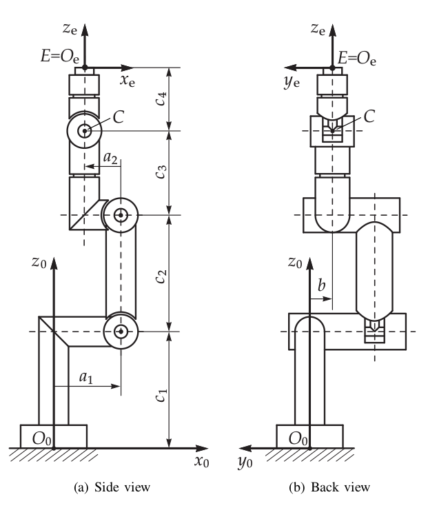

[](https://codecov.io/gh/Levi-Armstrong/opw_kinematics)

[](https://opensource.org/licenses/Apache-2.0)

# Intro
A simple, analytical inverse kinematic library for industrial robots with parallel bases and
spherical wrists. Based on the paper `An Analytical Solution of the Inverse Kinematics Problem
of Industrial Serial Manipulators with an Ortho-parallel Basis and a Spherical Wrist` by
Mathias Brandstötter, Arthur Angerer, and Michael Hofbaur.

# Purpose
This package is meant to provide a simpler alternative to IK-Fast based solutions in situations
where one has an industrial robot with a parallel base and spherical wrist. This configuration
is extremely common in industrial robots.

The kinematics are parameterized by 7 primary values taken directly from the robot's spec sheet
and a set of joint-zero offsets. Given this structure, no other setup is required.

# Build Status

Platform             | CI Status
---------------------|:---------
Linux (Focal)        | [](https://github.com/Jmeyer1292/opw_kinematics/actions)
Linux (Bionic)       | [](https://github.com/Jmeyer1292/opw_kinematics/actions)
Linux (Xenial)       | [](https://github.com/Jmeyer1292/opw_kinematics/actions)
Windows              | [](https://github.com/Jmeyer1292/opw_kinematics/actions)
Lint  (Clang-Format) | [](https://github.com/Jmeyer1292/opw_kinematics/actions)
Lint  (CodeCov)      | [](https://github.com/Jmeyer1292/opw_kinematics/actions)

# Parameters

This library makes use of 7 kinematic parameters (a1, a2, b, c1, c2, c3, and c4) defined in the paper `An Analytical Solution of the Inverse Kinematics Problem
of Industrial Serial Manipulators with an Ortho-parallel Basis and a Spherical Wrist`. See the paper for details.

This paper assumes that the arm is at zero when all joints are sticking straight up in the air as seen in the image below. It also assumes that all rotations are positive about the base axis of the robot.



To use the library, fill out an `opw_kinematics::Parameters<T>` data structure with the appropriate values for the 7 kinematic parameters and any joint offsets required to bring the paper's zero position (arm up in Z) to the manufacturers position. Additionally, there are 6 "sign correction" parameters (-1 or 1) that should be specified if your robot's axes do not match the convention in the paper.

For example, the ABB IRB2400 has the following values:
```c++
  Parameters<T> p;
  p.a1 = T(0.100);
  p.a2 = T(-0.135);
  p.b =  T(0.000);
  p.c1 = T(0.615);
  p.c2 = T(0.705);
  p.c3 = T(0.755);
  p.c4 = T(0.085);

  p.offsets[2] = -M_PI / 2.0;

  p.sign_corrections[0] = 1; // Already 1 by default; just an example
``` 

Note that the offset of the third joint is -90 degrees, bringing the joint from the upright position to parallel with the ground at "zero".

You can find other examples (many un-tested) taken from the source paper in `include/opw_kinematics/opw_parameters_examples.h`.

# Create Debian Package (Linux) or NuGet Package (Windows)

The following process will generate a Debian or NuGet package leveraging cmake and cpack based on the OS.

The package should be located in the current directory.

``` bash
cd <workspace directory>
catkin build -DOPW_PACKAGE=ON
./src/opw_kinematics/.run-cpack
```

# Example

```c++

#include "opw_kinematics/opw_kinematics.h"
#include "opw_kinematics/opw_parameters_examples.h" // for makeIrb2400_10<double>()
#include "opw_kinematics/opw_utilities.h" // for optional checking
#include <array>

int main()
{
  const auto abb2400 = opw_kinematics::makeIrb2400_10<double>();

  // Inverse kinematics
  auto pose = opw_kinematics::Transform<double>::Identity();
  pose.translation() = Eigen::Vector3d(1.3, 0.2, 0);

  // Up to 8 solutions exist
  // NaN indicates a solution did not exist
  std::array<double, 6 * 8> sols; // You could also use a std::vector or c-array of the appropriate size (6*8)
  opw_kinematics::inverse(abb2400, pose, sols.data());

  // Forward kinematics
  Eigen::Isometry3d forward_pose = opw_kinematics::forward(abb2400, &sols[6 * 0]);

  // Optionally, check for validity (this just makes sure there are no Nans in a solution)
  bool second_sol_is_valid = opw_kinematics::isValid(&sols[6 * 1]);

  // Optionally, harmonize the result toward zero in place
  // So if a joint is greater than PI or less than -PI, we add -2PI or +2PI respectively to move the joint solution closer to zero.
  opw_kinematics::harmonizeTowardZero(&sols[6 * 2]); // Harmonizes the third solution.

  return 0;
}

```

# Notes

The library returns the 8 kinematically unique solutions for a given pose. Note that:
 1. These solutions ARE NOT the ONLY solutions. For each joint that can rotate more than 2 * Pi, there exists redundant solutions. For example, if joint 6 can rotate -2*Pi to 2*Pi then a solution with joint 6 at 4.0 radians also has a solution with joint 6 at -2.28 radians and all other values the same.
 2. This library has no concept of LIMITS! Check your own limits. Be sure to check the redundant solutions to see if they are in limits. Consider calling `opw_kinematics::harmonizeTowardZero(T* qs)` in `opw_kinematics/opw_utilities.h` to help check these.
